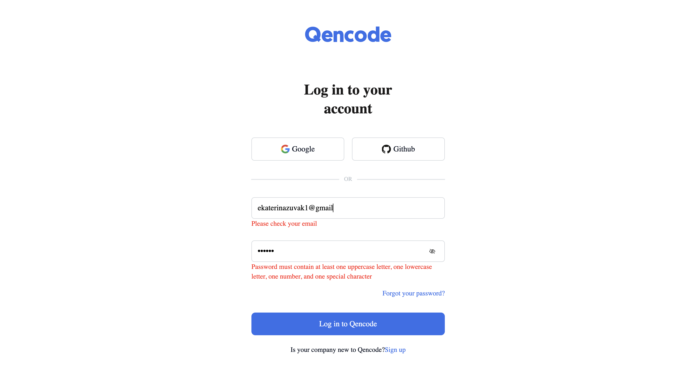
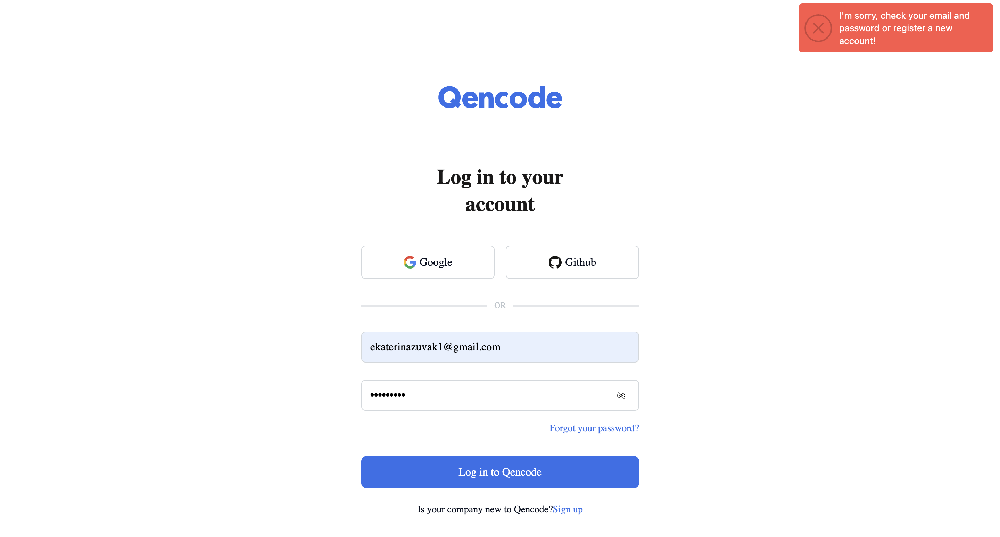
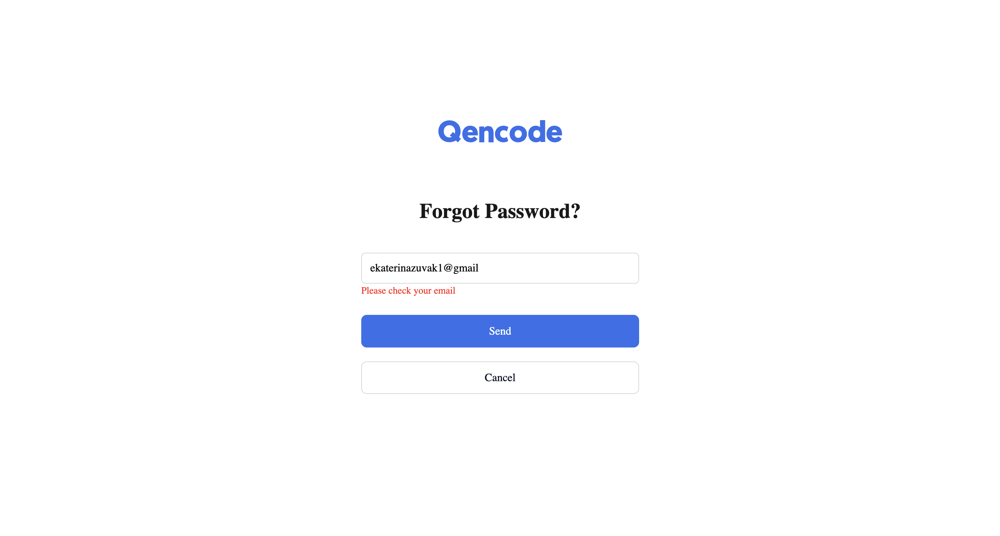
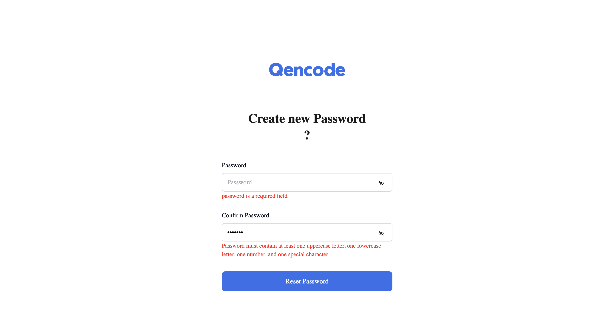
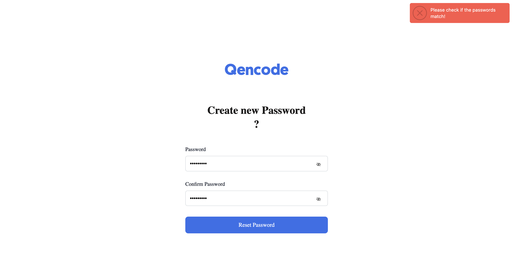

# Qencode

*This repository presents a login and password replacement form.*

## Table of Contents

- [Qencode](#qencode)
  - [Table of Contents](#table-of-contents)
  - [Installation](#installation)
  - [Usage](#usage)
  - [Used technologies](#used-technologies)
  - [Author](#author)
  - [Links](#links)


## Installation

1. Clone the repository to your computer
2. Open a terminal and enter the following commands: 
```JavaScript
npm install
```
```JavaScript
npm run dev
```

## Usage

+ Login page
  
  *on this page you can log in, the fields are checked for validity and appropriate messages appear to notify the user of errors or successful operations*




+ Forgot password page
  
  *On this page you can send a message to your email with a link to change your password.  There is also validation on the field with mail*

  

+ Reset password page
  
  *On this page you can replace the password with a new one, nothing will happen if the passwords are not the same, therefore there is validation and notification in case of errors on the part of the client*

  
  

## Used technologies

+ React
+ Redux-toolkit
+ React-router-dom
+ Redux-persist
+ React-redux
+ Styled-components
+ React-hook-form
+ Yup
+ Axios
+ Notiflix
+ Modern-normalize

## Author

*Kateryna Zhuvak*

+ [GitHub](https://github.com/KaterynaZhuvak)
+ [Linkedin](https://www.linkedin.com/in/kateryna-zhuvak/)
+ [Telegram](https://t.me/KaterynaZhuvak)

## Links

+ [API](https://auth-qa.qencode.com/v1/auth-api-references)
+ [Site](https://qencode-form.netlify.app/)


